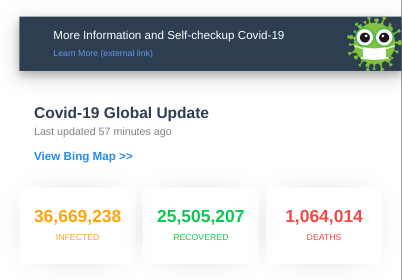
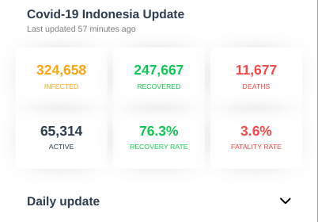
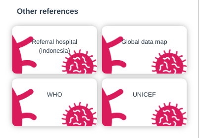
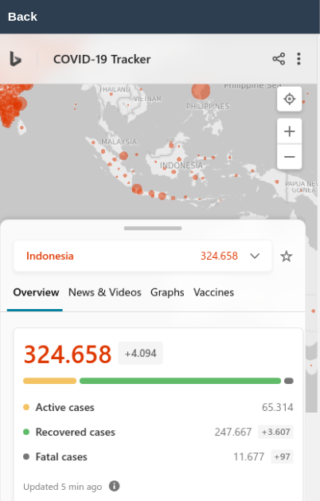
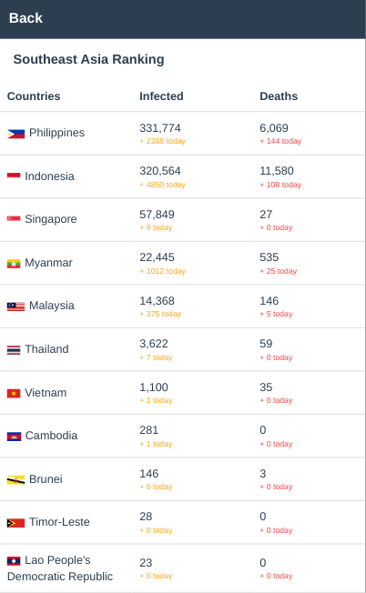

# Coronavirus Disease Monitoring

The purpose of this application is to provide information to the public about the spread of _coronavirus disease_ in __Indonesia__ and throughout the __World.__ Data from https://github.com/mathdroid/indonesia-covid-19-api

## Live Website

<https://covidmonitor.now.sh/>

## Screenshoot

|           Section 1           |           Section 2          |           Section 3          |
| :---------------------------: | :--------------------------: | :--------------------------: |
|  |  |  |

|           Section 4           |           Section 5          |
| :---------------------------: | :--------------------------: |
|  |  |

#### Section 1
Contains information on the spread of _coronavirus disease_ around the __World.__
#### Section 2
Contains information on the spread of _coronavirus disease_ in __Indonesia.__
#### Section 3
There are several references including _referral hospitals in Indonesia,_ _global data map,_ _WHO_ and _UNICEF._
#### Section 4
Is an embedded widget from _[bing](https://www.bing.com/covid/dev)_
#### Section 5
A page that displays a ranking of the most infections of _coronavirus diseases_ in the __Southeast Asia__ region

## Used
* git clone https://github.com/burhanahmeed/covidmonitor.git
* npm install
* npm start

## Feature
* [x] Responsive Design
